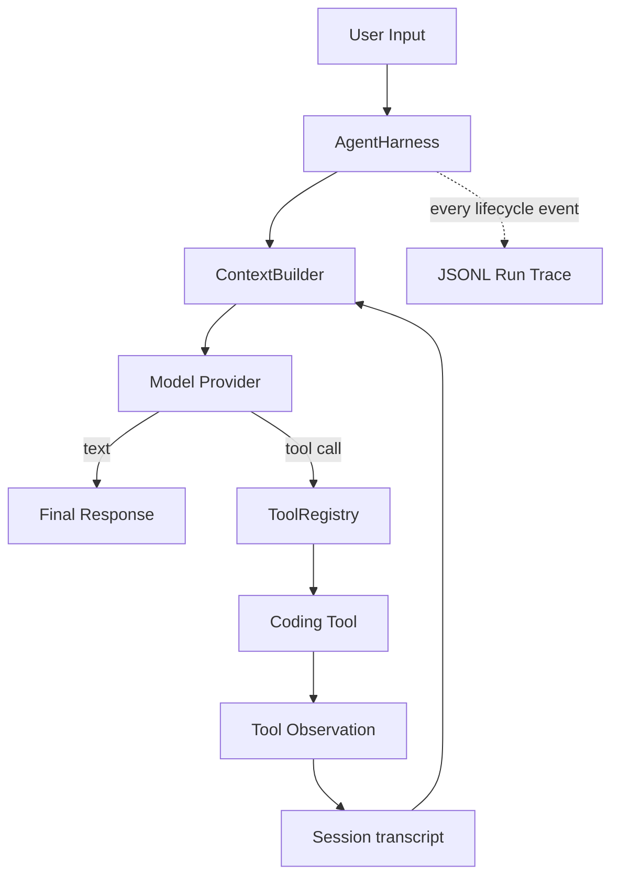

# v0.1 实现架构

本文描述仓库中已经实现并通过测试的架构。其他 architecture 文档包含研究与后续设计，不代表所有能力已经进入代码。

## 一句话定位

Axiom Agent 是模型之外的执行系统：模型决定下一步，Core 负责循环、状态、工具执行和生命周期；Provider、持久化、Trace 与 Coding Agent 均位于 Core 边界之外。

## 包边界

| 包 | 负责 | 不负责 |
|---|---|---|
| `@axiom-agent/core` | 单轮执行、Harness 循环、Session、Context、ToolRegistry、Event Stream | 模型 SDK、文件系统、UI、业务工具 |
| `@axiom-agent/openai-compatible` | Chat Completions 请求、SSE 与 tool call 协议转换 | Session、重试、工具执行 |
| `@axiom-agent/session-jsonl` | append-only transcript、跨进程恢复、断尾修复 | Context 构建、运行期事件 |
| `@axiom-agent/trace-jsonl` | 按顺序记录完整 `AgentEvent` 生命周期 | 模型 transcript |
| `@axiom-agent/coding-agent` | 工作区边界、coding prompt、四个 coding tools | 第二套循环或状态系统 |

## 执行链路



`executeTurn()` 是无状态的单轮原语；`AgentHarness` 持有 run 生命周期并重复调用它。`AgentDefinition` 只是配置，不是另一个 Runtime。

## 状态与恢复

- `Session` 定义 transcript 语义，`SessionStore` 决定存储方式。
- `JsonlSessionStore` 每个 session 使用一个安全编码的文件。
- 已换行 JSONL 记录视为 committed；进程中断留下的未换行尾部会在恢复时忽略、下次写入前修复。
- 新建 `Session` 与 `JsonlSessionStore`，复用同一 session ID，即可把历史重新投影进模型 Context。
- Transcript 只保存模型需要看到的 messages；Event Trace 单独保存 run/turn/tool/error 生命周期。

## Coding Agent 权限边界

v0.1 只有四个工具：`read_file`、`write_file`、`search`、`run_command`。

- 文件路径经过 lexical 与 canonical realpath 双重检查。
- 符号链接不能把读写目标带出 workspace。
- `run_command` 接收 executable + argv，不解析 shell 文本。
- executable 必须由应用显式 allowlist。
- 子进程环境经过过滤，不继承模型 API Key 等应用 secret。
- 这些措施属于 capability control，不是 OS 沙箱；运行不可信生成代码仍需要容器或宿主沙箱。

## 运行与验证

```bash
pnpm install
pnpm typecheck
pnpm test
```

无需模型即可观察跨进程恢复：

```bash
pnpm --filter @axiom-agent/example-resumable-session start demo first
pnpm --filter @axiom-agent/example-resumable-session start demo second
```

真实 Coding Agent CLI 位于 `examples/coding-agent`。端到端证据见[真实 Coding Agent 验证记录](../decisions/002-real-coding-agent-proof.md)。

## v0.1 明确不做

Memory、Skills、MCP、Subagent、并行工具、Compaction、复杂 Hook 与通用权限框架都不属于 v0.1。先用真实 Coding Task 证明小内核，再根据实际压力增加能力。
