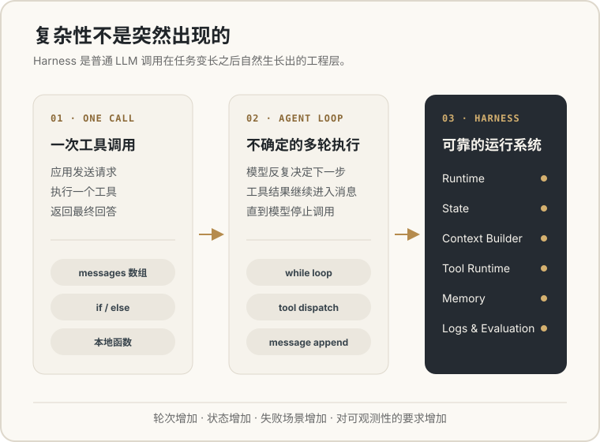
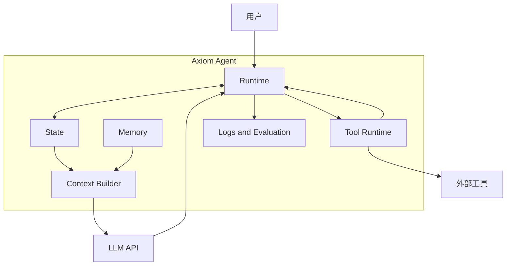

import MessagePlayground from '@site/src/components/MessagePlayground';
import ToolCallingPlayground from '@site/src/components/ToolCallingPlayground';

# 从一次 LLM API 调用到 Axiom Agent

在开始设计 Axiom Agent 之前，需要先回答一个基础问题：

> 一个大语言模型 API，为什么还需要一层工程系统？

LLM API 已经可以接收问题、生成回答，也可以返回工具调用请求。只看一个简单示例时，我们似乎只需要：

```text
用户输入
   ↓
  LLM
   ↓
调用工具
   ↓
返回结果
```

但当一次任务需要调用多个工具、持续多轮或者从错误中恢复时，一些问题会很快出现：

- 上一次执行到了哪里？
- 下一次模型调用应该携带哪些信息？
- 工具失败之后如何恢复？
- 用户如何知道当前正在执行什么？
- 历史信息越来越多，哪些内容还要继续发送给模型？

这些问题最终都会指向同一个方向：

> LLM 负责根据输入生成下一步结果，而可靠 Agent 还需要额外的工程层管理整个运行过程。

这一层，就是 Axiom Agent。

## 1. 一次普通的 LLM API 调用

先不考虑 Agent 和工具。一次最普通的 LLM API 调用，可以抽象为：

```ts
const response = await callLLM({
  messages,
});
```

这里的 `messages` 是一组按时间排列的消息。常见格式如下：

```json
[
  {
    "role": "system",
    "content": "你是一个回答简洁的助手。"
  },
  {
    "role": "user",
    "content": "为什么天空是蓝色的？"
  }
]
```

模型读取这些消息，然后返回一条新的 `assistant` 消息：

```json
{
  "role": "assistant",
  "content": "因为阳光进入大气层后，蓝色光比其他颜色更容易被散射。"
}
```

### Messages 中的角色

在常见的 LLM API 中，会看到四种角色：

| Role | 含义 |
| --- | --- |
| `system` | 系统提示词，用于定义模型需要遵守的规则、身份和约束。由于 API 不保存上一次请求，应用需要在后续请求中继续携带仍然有效的系统提示词 |
| `user` | 用户输入的问题或要求 |
| `assistant` | 模型生成的回答；既可能是给用户的文本，也可能包含工具名称和调用参数 |
| `tool` | 应用执行工具后返回给模型的结果。模型读取结果后，可以继续推理或生成最终回答 |

这里需要区分请求中的 `tools` 和 `role: "tool"`：

```text
APP 通过 tools 描述可用工具
          ↓
LLM 在 assistant message 中生成工具名称和参数
          ↓
APP 执行工具
          ↓
APP 通过 tool message 返回执行结果
          ↓
LLM 生成最终回答
```

<MessagePlayground />

*在左侧发送消息，观察右侧 `messages` 数组依次加入 `user` 和 `assistant` 消息。*

`messages` 可以理解为这一次调用时，应用交给模型阅读的对话记录。

从应用的角度看，LLM API 本质上是无状态的（stateless）：一次请求结束后，模型服务不会替当前 Agent 保存历史消息、工具结果或任务进度。下一次调用时，模型只会看到应用这一次提交的内容。

因此，模型不会自动读取应用数据库，也不知道上一次请求传入了什么。应用如果希望模型理解前文，就需要再次传入相关消息。

```text
Messages
   ↓
  LLM
   ↓
Assistant Message
```

不同模型服务的字段名称可能略有差异，但基本交互方式相似：应用组织输入，模型根据输入生成结果。

## 2. LLM 如何调用工具？

严格来说，LLM 不会亲自执行工具。

它通过 Function Calling、Tool Calling 或 Tool Use，生成包含工具名称和参数的结构化调用请求。应用读取这条请求、执行对应工具，再把结果返回给模型。

早期 API 通常称为 Function Calling。随着 Agent、MCP 和外部执行环境的发展，Tool Calling 或 Tool Use 成为更宽泛的表达。它们描述的是同一种核心过程：

> LLM 决定调用什么，应用负责真正执行。

下面的交互演示从“北京今天需要带伞吗？”开始。你可以逐步点击，也可以自动播放整个过程。重点观察两件事：

1. 当前动作究竟由用户、应用、模型还是工具执行。
2. 每一步之后，`messages` 数组增加了什么。

<ToolCallingPlayground />

最容易产生误解的地方是：

> 模型只生成了“请调用 `get_weather`”的结构化请求。解析参数、执行函数以及返回结果，全部由应用代码完成。

<details>
<summary>查看与演示等价的核心代码</summary>

```ts
const messages = [
  {
    role: "user",
    content: "北京今天需要带伞吗？",
  },
];

const firstResponse = await callLLM({
  messages,
  tools,
});

messages.push(firstResponse.message);

const result = await getWeather({
  city: "北京",
});

messages.push({
  role: "tool",
  tool_call_id: "call_1",
  content: JSON.stringify(result),
});

const finalResponse = await callLLM({
  messages,
  tools,
});
```

</details>

一个简单应用完全可以用几十行代码完成这个过程。Harness 并不是让工具调用“从无到有”，而是把这套过程变成可持续运行、可控制和可观察的系统。

## 3. Tool Calling 为什么会形成 Agent Loop？

如果模型每次只调用一个工具，上面的代码已经足够。

但模型拿到天气结果后，也可能继续请求另一个工具；新工具的结果又可能引出下一次调用。应用无法提前确定需要执行多少轮。

于是代码会自然变成一个循环：

```ts
while (!finished) {
  const response = await callLLM({
    messages,
    tools,
  });

  messages.push(response.message);

  if (response.toolCall) {
    const result = await executeTool(response.toolCall);

    messages.push({
      role: "tool",
      tool_call_id: response.toolCall.id,
      content: JSON.stringify(result),
    });

    continue;
  }

  finished = true;
}
```

这就是最基础的 Agent Loop：

```text
模型决定下一步
   ↓
应用执行动作
   ↓
结果返回给模型
   ↓
模型继续决定
```

循环本身并不复杂。真正复杂的是它周围的工程问题：

- 工具参数是否合法？
- 这个工具是否允许当前用户执行？
- 工具超时后是否重试？
- 执行失败后把什么信息交还给模型？
- 用户中断任务时，如何停止正在运行的工具？
- 整个调用过程如何记录和回放？

> Tool Calling 让模型可以提出影响外部世界的动作，而 Harness 负责控制这些动作如何执行。

到这里，一个最小 Agent 已经可以工作：只要不断把模型回答和工具结果追加到 `messages`，再把整个数组发给模型。

但“能够工作”和“能够长期可靠地工作”之间，还有一段距离。

## 4. 只靠不断追加 Messages，会发生什么？

最直接的实现通常只有一行：

```ts
messages.push(newMessage);
```

每一轮都把完整的 `messages` 再次发送给模型。对几轮短对话来说，这种方式简单而有效；当任务持续变长时，它会同时带来几个问题。

### 注意力被无关信息稀释

模型看到的信息越多，不代表判断一定越准确。

长任务中可能存在：

- 已经失效的旧要求
- 失败后放弃的执行分支
- 与当前步骤无关的工具结果
- 大量重复的状态描述

如果这些内容一直留在 Messages 中，模型仍然需要阅读并判断它们是否重要。真正需要关注的信息反而更难突出。

这可以理解为一种注意力问题：

> 有效上下文不是信息越多越好，而是当前需要的信息足够完整、相关并且清晰。

### 输入越长，模型响应越慢

模型生成回答之前，需要先处理本次请求中的输入。

Messages 越长：

- 需要传输的数据越多
- 模型读取输入的时间越长
- 首个输出片段出现得越晚
- 每次调用消耗的 token 和费用越高

即使每一轮只新增少量内容，完整历史被反复发送后，延迟和成本也会逐步累积。

### 最终会超过 Context Window

模型一次能够读取的 token 数量存在上限，通常称为 Context Window。

当 Messages 超过这个范围时，应用只能选择：

- 删除一部分旧消息
- 把历史压缩成摘要
- 更换支持更大上下文的模型
- 或者让请求直接失败

因此，`messages.push()` 只是保存消息的动作，并不是完整的 Context Management 策略。

### Messages 也无法表达全部运行状态

Messages 是给模型阅读的输入协议，但 Agent 运行时还需要记录一些不应该完全依赖对话文本的信息：

- 当前正在调用模型还是等待工具
- 已经执行到第几步
- 某个工具是否正在重试
- 用户是否请求暂停或取消
- 哪一次失败需要恢复

如果应用不主动保存这些信息，请求结束或进程退出后，消息和执行进度也可能一起消失。

这正是 Agent 必须拥有 State 的根本原因：LLM API 可以是无状态的，但一个需要暂停、恢复和持续执行的任务不能是无状态的。

这时还需要进一步区分 State 和 Context。

### State：保存任务已经发生的全部事实

State 是 Agent 运行过程的完整记录，例如：

- 完整消息历史
- 工具调用和执行结果
- 当前步骤与运行状态
- 错误、重试和中断信息
- 文件或其他结构化结果

最简单的 State 只有消息：

```ts
interface AgentState {
  messages: Message[];
}
```

任务复杂后，可以继续加入不适合塞进 Messages 的运行字段：

```ts
interface AgentState {
  runId: string;
  status: "running" | "waiting_tool" | "completed" | "failed";
  messages: Message[];
  step: number;
  toolResults: ToolResult[];
}
```

Runtime 读取和更新 State，决定下一步调用模型、执行工具、等待用户还是结束任务。

State 的目标是尽量完整地保存事实，因此它可以很大，也不需要全部发送给模型。

### Context：选择模型这一次真正需要看到什么

Context 是 Runtime 根据当前目标，从 State 中选择出来并发送给模型的信息。

```text
完整的 Agent State
        ↓
  Context Builder
        ↓
本次请求使用的 Messages
        ↓
       LLM
```

Context Builder 需要决定：

- 当前步骤需要保留哪些消息？
- 哪些旧消息已经无关？
- 哪些历史可以压缩成摘要？
- 哪些工具结果必须原样保留？
- 本次请求还有多少 token 预算？

因此：

> State 负责“不丢失事实”，Context 负责“不让模型看到过多无关事实”。



*Harness 不是另一套模型协议，而是手写循环在复杂任务中逐步形成的运行系统。*

## 5. Streaming 为什么会影响 Runtime？

模型的回答可以一次性返回，也可以逐段返回。逐段返回通常称为 Streaming。

```text
Request
   ↓
文字片段 1
   ↓
文字片段 2
   ↓
Tool Call
   ↓
Tool Result
   ↓
Final Response
```

在普通聊天页面中，Streaming 可以实现逐字显示。但在 Agent 中，界面还需要呈现：

- 模型正在生成回答
- 某个工具开始执行
- 工具执行成功或失败
- 整个任务完成或被中断

因此 Runtime 更适合向外发送事件，而不是只在最后返回一个字符串：

```ts
type AgentEvent =
  | {type: "message.delta"; text: string}
  | {type: "tool.started"; name: string}
  | {type: "tool.completed"; result: unknown}
  | {type: "run.completed"};
```

这些事件可以同时用于 UI 更新、状态同步、日志记录和问题排查。

Streaming 不只是打字效果，它会影响 Runtime 如何组织和暴露整个运行过程。

## 6. 当任务继续变长：Context Management 与 Memory

确定不能无限追加 Messages 之后，Harness 需要主动管理每一次模型输入：

- 删除已经无关的消息
- 把较长历史压缩成摘要
- 从长期记忆中检索当前相关信息
- 只引用必要的文件和工具结果

```text
State + Memory + Rules + Token Budget
                  ↓
            Context Builder
                  ↓
       本次请求使用的 Messages
```

Context Builder 很像一个编译器：它将 Agent 保存的状态转换成模型能够有效使用的输入。

Memory 也不是简单地把更多历史塞进 Messages。它负责长期保存信息，Context Builder 则只在当前任务需要时取回相关部分。

## 7. 从 LLM API 到 Axiom Agent

现在可以看出，普通 LLM API 已经提供了构建 Agent 所需的基础协议：

```text
Messages
Tool Calls
Streaming
Model Output
```

Axiom Agent 并不替代这些能力，而是在它们外面增加一层运行系统：

```text
Runtime
State Management
Context Builder
Tool Runtime
Memory
Logs and Evaluation
```



## 总结

从最普通的 LLM API 调用开始，可以得到几个结论：

1. Messages 是应用每次发送给模型阅读的消息序列。
2. 模型只会生成 Tool Call，真正的工具执行由应用完成。
3. 工具结果需要作为 `tool` 消息加入 Messages，再次调用模型。
4. 多次 Tool Calling 会自然形成 Agent Loop。
5. 不断追加 Messages 会带来注意力稀释、响应变慢和上下文溢出。
6. Runtime 和 State 让这个循环能够暂停、恢复、重试和记录。
7. Context Builder 决定每次真正把哪些 Messages 发送给模型。

> Axiom Agent 的作用，不是把普通 LLM API 包装得更复杂，而是把手写在应用代码里的消息管理、工具执行和多轮循环，变成一个可靠、可持续运行的工程系统。

后续章节将继续展开 Agent Loop、Context Engineering、Tool Runtime、Memory、Evaluation 和 Runtime Architecture。
